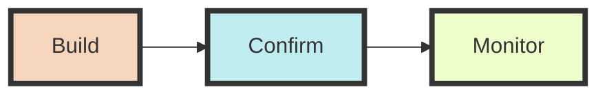

# Introduction
Set of programs for Interactive Brokers - <b>Trade Order Management System (TOMS)</b>

# TODOs
* [ ] Document **TOMS**
* [ ] *dfrq* elimination in *nakeds.py*
* [ ] Add YAML `filter` selection for *nakeds.py*
* [ ] Make a `Connection` class that detects if server is up or not

## TODO: Questions for analysis
* Maximum grosspos for NSE (strike * lot). This should be the grosspos benchmark.
* Extract bid-ask-last for NSE from website. This is useful for pre-market trade setup.

# Methodology

## Build

* Builds a `base` model for options:
  - either with *prices* and *margins*
  - or without *prices* and *margins*
* Makes
  - `covers` for covered calls and puts SELLs
  - `defends` for defending existing positions BUYs
  - `orphans` for orphaned defenses
  - `harvests` for matured options

<ins>Note</ins>
* Build uses functions from engine.py and support.py
* `base` model can be built on **`PAPER`** account
* `covers`, `defends`, `orophans` and `harvests` require **`LIVE`** account

## Confirm

* Visualize and evaluate OHLC unds and options
* Evaluate overall Positions, P&L and Risk scenarios 
* Adjust YAML parameters
* Deep-dive on specific symbols
* Order 

## Monitor

* Breaches
* Orders and Fills
	- Dynamic price modification upon fill
* Positions 
	- with Status (balanced, orphaned, uncovered, undefended, dodos, unharvested)
	- for Risk: Reward
* System health

# Core Functions

## 1. ENGINE FUNCTION:

### For a market

* generate `df_symlots`

* make `und_cts`

* from und_cts generate:
	* `df_unds.pkl`
	* `df_ohlcs.pkl`
	* `df_chains.pkl`
	
	* generate `und_margins`
		* update `df_unds` with `und_margins`

	* `qualify_opts` 
    	* with an option to REUSE  

## 2. DFRQ FUNCTION:
* For remaining quantities `remq` based on position and risk

## 3. NAKEDS FUNCTION:

* run `dfrq`

* generate `df_opts` by:
	* loading `qopts.pkl` (or) running QUALOPTS function
	* get option `margin`, `price` and `iv` with `time_stamp`
	* save `df_opts.pkl`

## 4. ORPHAN FUNCTION
* For orphaned options
	
	
## 5. COVER FUNCTION
* For the uncovered	
	
	
## 6. DEFEND FUNCTION
* For the undefended and inadequately defended

## 7. HARVEST FUNCTION
* For ripe NAKEDs

## 8. SYSTEMATIC FUNCTION
* Automate trades

## 9. REPORTS & ANALYSIS
* Daily trades and performance
* Slice & Dice
* Key learnings
* Wish list

# Supports

## Classes
### Establish variables from YAML: `Vars` 
...
### Set up time measurements for core functions: `Timer`
...

## Functions
### Days to Expiry: `get_dte`
### Standard Deviation Multiple for a df: `calcsdmult_df`
- Typically used for `strike` price

### Standard Deviation Multiple for one price: `calcsd`

### Convert to absolute integer to prevent div-by-zero error: `abs_int`

### Check if the market is open for trades: `isMarketOpen`

### Generate portfolio quickly: `quick_pf`

### Generate P&L: `get_pnl`

# Installation Notes:

## 1. VS Code

### Extensions installed
* [Python](https://marketplace.visualstudio.com/items?itemName=ms-python.python)
* [Juypter](https://marketplace.visualstudio.com/items?itemName=ms-toolsai.jupyter)
* [Better Comments](https://marketplace.visualstudio.com/items?itemName=aaron-bond.better-comments) - for colour-coding comments
* [Markdown Peview Enhanced](https://marketplace.visualstudio.com/items?itemName=shd101wyy.markdown-preview-enhanced) - also supports mermaid!
	* [Mermaid Markdown Syntax Highilighting](https://marketplace.visualstudio.com/items?itemName=bpruitt-goddard.mermaid-markdown-syntax-highlighting)
* [Peacoock](https://marketplace.visualstudio.com/items?itemName=johnpapa.vscode-peacock) - for colour-coding vs code instances

### * Enable `black` formatter with auotosave
   - *Note*: black has to be installed `pip install black`

* Go to Settings -> `python formatting provider` and choose `black` in it

* Alternatively set the following in .vscode-> settings.json:
>    "python.formatting.provider": "black",
>    "editor.formatOnSave": true

### * Disable pyling warning
 - `Instance has no member for class`
* Set the following in .vscode->settings.json:
> "python.linting.pylintArgs":[ "--load-plugins"] 

### * Enable organize imports on save
> "editor.codeActionsOnSave": {"source.organizeImports": true}