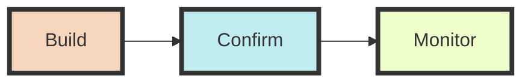
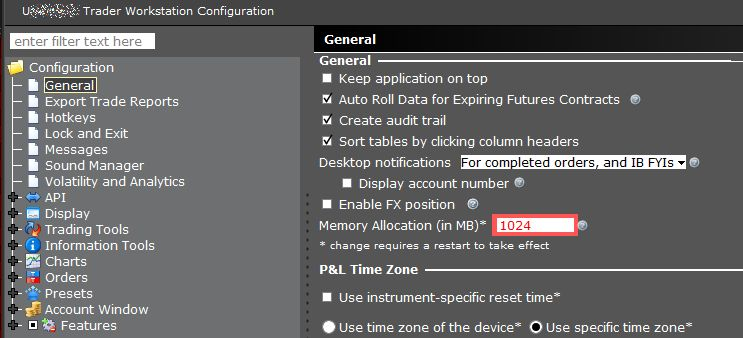
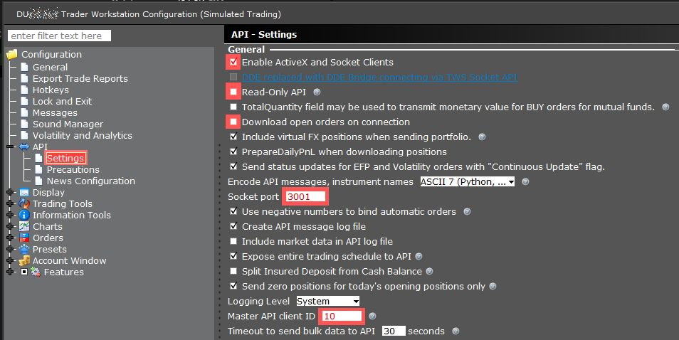
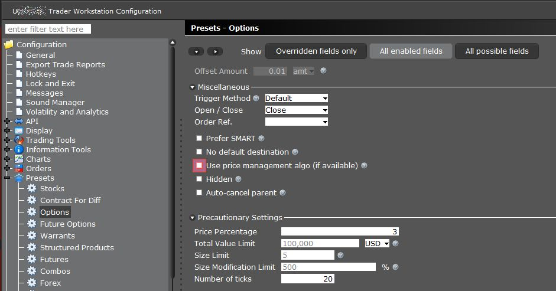
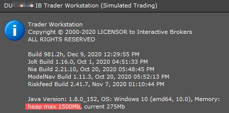

# TODOs
* [x] Build `opts.py` to qualify options from chains - reusing `opts.pkl`
* [x] Include `14-day` rsi in df_opts
* [x] Include `rise` and `fall` for dte in df_opts
* [x] make `opts.py` into a function
* [x] add `opts.py` to `base.py`
* [x] remove `get_opts` function from `engine.py`

* [x] Make `price` function for bid-ask-last prices robust

* [x] remake `nakeds.py` picking up df_opts with price, margin and roms
	* [ ] Add YAML `filter` selection for strategies
	* [x] Use the robust `qpAsync` price
	* [x] Get the margins
	* [x] Compute rom and pop
	* [x] Compute expected price
	* [x] Pickle the nakeds

* [ ] `Deep-dive` for a single option/dte combination
	* [ ] Plot option and underlying OHLCs with standard deviations
	* [ ] Sort by `best-trade` - a combo of Reward/Risk, rom and prop

* [ ] Do `harvests` and `monitor`

* [ ] remove `get_price` and `get_margin` from `base.py` after checking where used

* [ ] make dataclasses

# Introduction
Set of programs for Interactive Brokers - <b>Trade Order Management System (TOMS)</b>

# Strategy

## Order `nakeds` at
* ~ 1.35 standard deviation and above. Set in var.yml: CALLSTDMULT & PUTSTDMULT
* 4 to 35 days dte - to give a rolling monthly churn
* quantities upto `remq` - from dfrq
* return fixed at the rom of option price closest to 1.35 sd, nearest dte
* direction driven by 14-day rsi, with some manual intervention based on deep-dive
  - `Puts` below 40 (oversold)
  - `Calls` above 60 (overbought)
  - Both `Puts` and `Calls` between 40 and 60
* honoring overall margin cushion

## Manage short option positions

Each short position will have a corresponding:
* `harvest` LMT BUY order - based on a harvest curve
* `protect` STP BUY order at 3 times the average price

## Manage assignments

In case shorts get assigned:
* `cover` at 1 standard deviation for the first week
	- standard deviation will be reduced after every subsequent week
	- after 4 weeks, position will be closed

## Automated trade (advanced)
* adjust price of existing orders upon fill
* provide `harvest` and `protect` orders upon fill
* cancel `protect` upon `harvest` fill and vice-versa

# Methodology


## Build

This step is done every day before the market opens.

* `Base` model for options comprising:
  - underlyings with price and iv
  - underlying OHLCs
  - option chains

* `Opts` generation
  - qualified options for all dtes

* `Price` model for qualified options

  - When market is closed:
	- `last` price and `iv` from mktData
	- `bid` and `ask` will usually be `-1.0`
	- `Selective bid-ask` from histData

  - When market is open
    -  `bid`, `ask`, `last` and `iv` from mktData

* `Margin` model for all qualified options

* For **SNP**:
  - `covers` for covered calls and puts SELLs
  - `defends` for defending existing underlying positions BUYs
  - `orphans` for orphaned defenses

<ins>Note</ins>
* Build uses functions from engine.py and support.py
* `base` and `opts` can be built on **`PAPER`** account
* `price`could be either **`LIVE`** or **`PAPER`** accounts
* `covers`, `defends`, `orphans`, `harvests` and `protects` are to be done on a **`LIVE`** account
  - the sd limits for these are based on YAML configurations set

## Confirm

* Evaluate overall Positions, P&L and Risk scenarios 
* Adjust YAML parameters

* Extract `nakeds` based on strategy, like:
  - based on var.yml: CALLSTDMULT and PUTSTDMULT
  - 4-35 days
  - remq based quantities
  - fixed rom
  - honoring direction based on 14-day RSI
  - honoring overall margin cushion

* Do sample checks on nakeds
  - with OHLC visualization for unds and options
  - Deep-dive on specific symbols

* Order
  * For SNP:
	- `nakeds`, `harvests`, `protects` - for options
	- `covers` and `defends` - for assigned stocks 
  * For NSE:
    - `nakeds`, `harvests`, `protects` - for options

## Monitor

* Overall margin limit situation agains breach limit

* For each **symbol**
	- Status (balanced/orphaned/uncovered/undefended/dodos/unharvested)
	- Margin situation against breach limit
	- Risk / Reward on overall positions for the symbol
	- Probability of profit (prop) for the overall positions of the symbol 
	- Open orders

* Dynamic price modificiation of open orders upon a `fill`

* System health

# Core Functions

## 1. ENGINE FUNCTIONS:

A set of functions running on IB clientID provided

### For a market

* generates `df_symlots`

* makes `und_cts`

* from und_cts generates:
	* `df_unds.pkl`
	* `df_ohlcs.pkl`
	* `df_chains.pkl`
	
	* generates `und_margins`
		* update `df_unds` with `und_margins`

	* qualifies the options `qualify_opts` 
    	* with an option to REUSE  

## 2. DFRQ FUNCTION:

Runs independently on `clientID = 0`

Generates remaining quantities `remq` based on individual and overall position
* Gets margins consumed by portfolio
* Computes the gross positions
* Computes remaining quantities based on each gross position
* Builds statuses from portfolio:
	* Statuses are: `partial`, `nakeds`, `orphans`, `uncovered`, `undefended`, `dodos`, `balanced` and `harvest`
		* Note: `harvest` includes `protects`

## 3. NAKEDS FUNCTION:

Runs independently on `clientID = 0`

* runs `dfrq`

* determines standard deviations from YAML settings
	* removes `blacklists`

* integrates `fallrise`

* generate `df_opts` by:
	* loading `qopts.pkl` (or) running QUALOPTS function
	* get option `margin`, `price` and `iv` with `time_stamp`
	* separates `call` and `put` options
	* save `df_nakeds.pkl` and `df_nakeds.xlsx` 

* has options to:
	- recalculate underlyings
	- generate only for one symbol
		- useful for weekend / Friday trades on specials
	- give only the earlies DTE
	- saving in custom filenames

## 4. ORPHAN FUNCTION
* For orphaned options
	
	
## 5. COVER FUNCTION
* For the uncovered	
	
	
## 6. DEFEND FUNCTION
* For the undefended and inadequately defended underlying positions


## 7. # TODO: HARVEST FUNCTION
* For ripe NAKEDs


## 8. # TODO: MONITOR FUNCTION
* Automate trades

## 9. TODO: REPORTS & ANALYSIS
* Daily trades and performance
* Slice & Dice
* Key learnings
* Wish list

# Support functions
* in support.py

## Classes
* Establish variables from YAML: `Vars` 
* Set up time measurements for core functions: `Timer`

## Functions
### Days to Expiry: `get_dte`
### Standard Deviation Multiple for a df: `calcsdmult_df`
- Typically used for `strike` price

### Standard Deviation Multiple for one price: `calcsd`

### Convert to absolute integer to prevent div-by-zero error: `abs_int`

### Check if the market is open for trades: `isMarketOpen`

### Generate portfolio quickly: `quick_pf`

### Generate P&L: `get_pnl`

# Installation Notes:

## 1. IBKR

### Use pre-defined xml configuration
* Found in `./data/template` folder
* If not found, or not working, try adjusting the following:
#### a. Set memory size
Choose 1024 MB memory allocation option as shown below, in *File -> Global Configuration*:


#### b. API settings
Use the following API settings in *File -> Global Configuration* :

* Ensure that the socket-port is aligned to your PAPER v/s LIVE strategy

#### c. Disable `Price Management Algo` in TWS
A pesky `price management algo` message which freezes the screen, appears when placing multiple orders in TWS. To disable this:

- Click on the File (or Edit) menu
- Select Global Configuration
- Select Presets followed by Stocks (or any other contract type)
- Scroll down to the Miscellaneous section and check or uncheck the box for Use Price Management Algo
- Click Apply and OK to save the change.


### d. Set heapsize
Edit `C:\Jts\tws.vmoptions` file to adjust the heapsize as shown in the picture below. You can find this in *Help -> About <ins>T</ins>rader workstation...* menu.



Refer [to this link](https://www.interactivebrokers.com/en/software/tws/usersguidebook/priceriskanalytics/custommemory.htm) for more details.

### e. `ddedll.dll file error` prevention
* Install 32-bit IB Gateway, instead of 64-bit in Windows 10

## 2. Jupyter Lab

### Set up Jupyter to start in the folder of choice
* Build a shortcut for Jupyter Lab
* Set the shortcut to open in folder of choice
	- Refer to [this stackoverflow post](https://stackoverflow.com/a/40514875/7978112) 

## 3. VS Code

### Extensions installed
* [Python](https://marketplace.visualstudio.com/items?itemName=ms-python.python)
* [Pylance](https://marketplace.visualstudio.com/items?itemName=ms-python.vscode-pylance)
	- For good linting, including unused imports, set *settings.json* to:  
		```
		...
		"python.linting.pylintEnabled": true,
		"python.linting.enabled": true,
		"python.languageServer": "Pylance"
		...
* [Juypter](https://marketplace.visualstudio.com/items?itemName=ms-toolsai.jupyter)
* [Better Comments](https://marketplace.visualstudio.com/items?itemName=aaron-bond.better-comments) - for colour-coding comments
* [Markdown Peview Enhanced](https://marketplace.visualstudio.com/items?itemName=shd101wyy.markdown-preview-enhanced) - also supports mermaid!
	* [Mermaid Markdown Syntax Highilighting](https://marketplace.visualstudio.com/items?itemName=bpruitt-goddard.mermaid-markdown-syntax-highlighting)
* [Peacoock](https://marketplace.visualstudio.com/items?itemName=johnpapa.vscode-peacock) - for colour-coding vs code instances
* [Color Manager](https://marketplace.visualstudio.com/items?itemName=RoyAction.color-manager) - for consistent color coding scheme from `lopsec.com Pixelart Palettes`

### * Enable `black` formatter with auotosave
   - *Note*: black has to be installed `pip install black`

* Go to Settings -> `python formatting provider` and choose `black` in it

* Alternatively set the following in .vscode-> settings.json:
>    "python.formatting.provider": "black",
>    "editor.formatOnSave": true

### * Disable pylint warning
 - `Instance has no member for class`
* Set the following in .vscode->settings.json:
> "python.linting.pylintArgs":[ "--load-plugins"] 

### * Enable organize imports on save
> "editor.codeActionsOnSave": {"source.organizeImports": true}