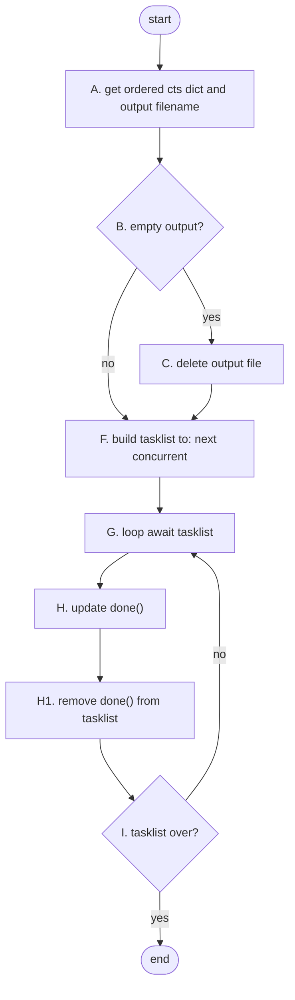

# Mermaid
## Introduction
* [Mermaid](https://mermaid-js.github.io/mermaid/) is a good utility for quick illustration purposes while coding.
* Mermaid files are accessible in [markdown](https://commonmark.org/)
* Mermaid is integrated in Gitlab, but not in Github
  * If Github is your repository, you may want to:
    * convert mermaid to SVG file using [mermaid live editor](https://mermaid-js.github.io/mermaid-live-editor)
    * insert the svg file into markdown using: 
        * ``````
* Mermaid can be initiated using block comment in a markdown file as shown below in the sample flow
## Sample flow


## Mermaid Best Practice (Rules)

### General
* Use [mermaid live editor](https://mermaid-js.github.io/mermaid-live-editor) to play develop the code


### For flowcharts
* Always use Top Down (`graph TD`)
  - left-right would make it difficult to view and may not fit well in GitLab
* First collect all the blocks. Then build the relationship diagram.
* Put the index number of the block in its description
  * This helps easier cut-and-paste to move
* For each block 
   - use description in all `small case`
   - use sequential branch alphabet to indicate branch level (e.g. `A. initialize`)
   - keep descriptions small
   - Don't describe the left node
* For `start` block use single underscore (`_`) as a marker
* For `end` block use double underscore (`__`) as a marker
* Keep `start` and `end` distinct, without anything coming out of them
* For decision diamonds
   -  have branch alphabet with a numeric. For e.g. <pre>  
            A --> B{B. remaining?}
            B -->|yes| C1{C1. >= concurrents?}
            B -->|no| __</pre>
   - keep descriptions very small
   - ensure that the `yes` and `no` decision branches are closed!